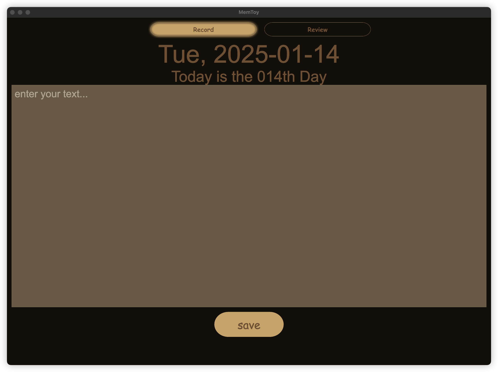
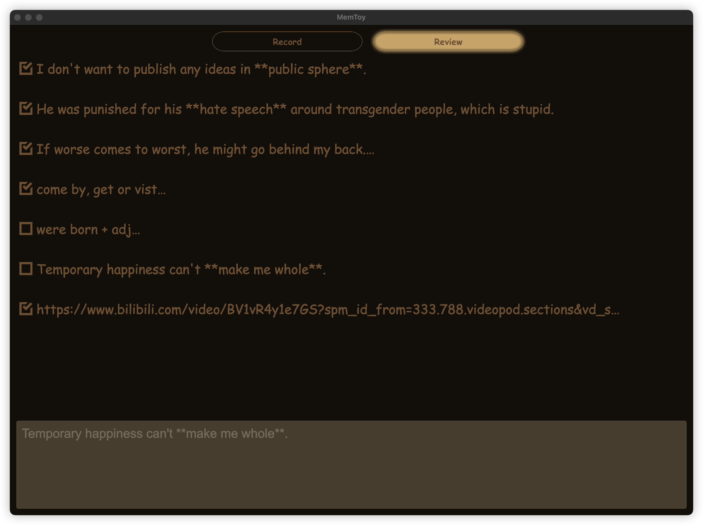

# MemToy

  

A self-used toy project for memorizing something. MemToy is designed to help you record and review information in a fun and efficient way. Whether you're studying, working, or just trying to remember important details, MemToy has got you covered.

<!--toc:start-->
- [MemToy](#memtoy)
  - [Record](#record)
  - [Review](#review)
  <!--toc:end-->

## Record

The **Record** feature allows you to easily input and save information that you want to remember. You can add notes, tags, and even images to make your records more comprehensive.

### How to Use

1. Open the **Record** section.
2. Enter the information you want to memorize.
3. Add tags or categories for better organization.
4. Save your record for future review.

## Review

The **Review** feature helps you go through your saved records to reinforce your memory. You can filter records by tags, dates, or categories to focus on specific topics.

### How to Use

1. Open the **Review** section.
2. Select the records you want to review.
4. Double click the record to open the link if exists.

---

MemToy is your personal assistant for memory retention. With its simple and intuitive interface, you can easily keep track of important information and ensure that it stays fresh in your mind. Start using MemToy today and make memorization a breeze! 🦀☕
